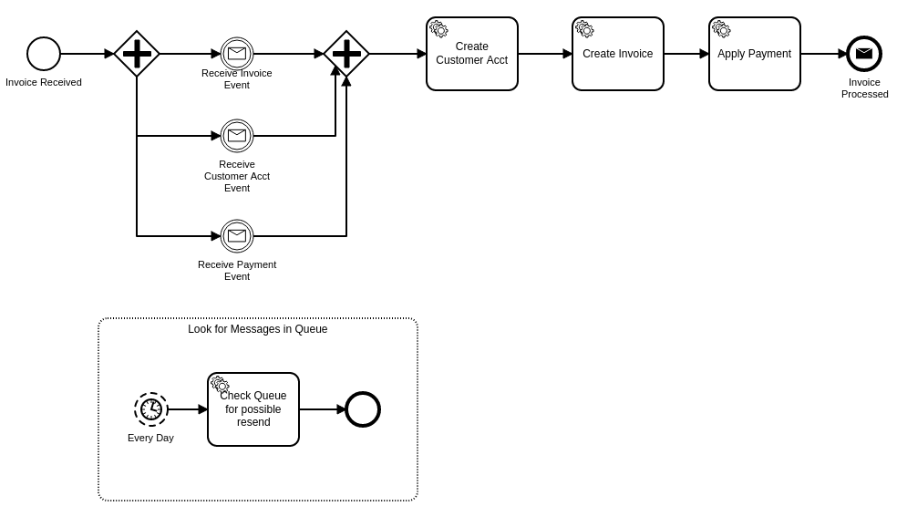

# Process Invoice

## Camunda Spring Boot Application

This is a simple example that includes the following:

1. A process called "Process Invoice".  Once started, it wait for three message events to arrive before finishing.
2. A custom web service that accepts an invoice.  Once it receives this invoice, it will get embedded into a Camunda web service request to kick off the Process Invoice process, then it will call Camunda.
3. A postman collection to initiate:
   1. The first web service call with the invoice.
   2. The Camunda web service calls to simulate the correlation of the messages.

When testing the message correlation, note that the message correlation payload JSON needs a unique business key for the process instance.  Please retrieve that from Cockpit.

--------


Spring Boot Application using [Camunda](http://docs.camunda.org).

This project has been generated by the Maven archetype
[camunda-archetype-spring-boot-7.11.1](http://docs.camunda.org/latest/guides/user-guide/#process-applications-maven-project-templates-archetypes).


## Show me the important parts!

[BPMN Process](src/main/resources/multipleEvents.bpmn)



## How to use it?

### Running the application
You can also build and run the process application with Spring Boot.

#### Manually
1. Build the application using:
```bash
mvn clean package
```
2. Run the *.jar file from the `target` directory using:
```bash
java -jar target/Camunda Spring Boot Application.jar
```

For a faster 1-click (re-)deployment see the alternatives below.

#### Maven Spring Boot Plugin
1. Build and deploy the process application using:
```bash
mvn clean package spring-boot:run
```

#### Your Java IDE
1. Run the project as a Java application in your IDE using CamundaApplication as the main class.

### Run and Inspect with Tasklist and Cockpit
Once you deployed the application you can run it using
[Camunda Tasklist](http://docs.camunda.org/latest/guides/user-guide/#tasklist)
and inspect it using
[Camunda Cockpit](http://docs.camunda.org/latest/guides/user-guide/#cockpit).

## Environment Restrictions
Built and tested against Camunda BPM version 7.11.0.

## Known Limitations

## License
[Apache License, Version 2.0](http://www.apache.org/licenses/LICENSE-2.0).

<!-- HTML snippet for index page
  <tr>
    <td></td>
    <td><a href="snippets/cam-sb-create-account">Camunda Spring Boot Application</a></td>
    <td>Spring Boot Application using [Camunda](http://docs.camunda.org).</td>
  </tr>
-->
<!-- Tweet
New @Camunda example: Camunda Spring Boot Application - Spring Boot Application using [Camunda](http://docs.camunda.org). https://github.com/camunda-consulting/code/tree/master/snippets/cam-sb-create-account
-->